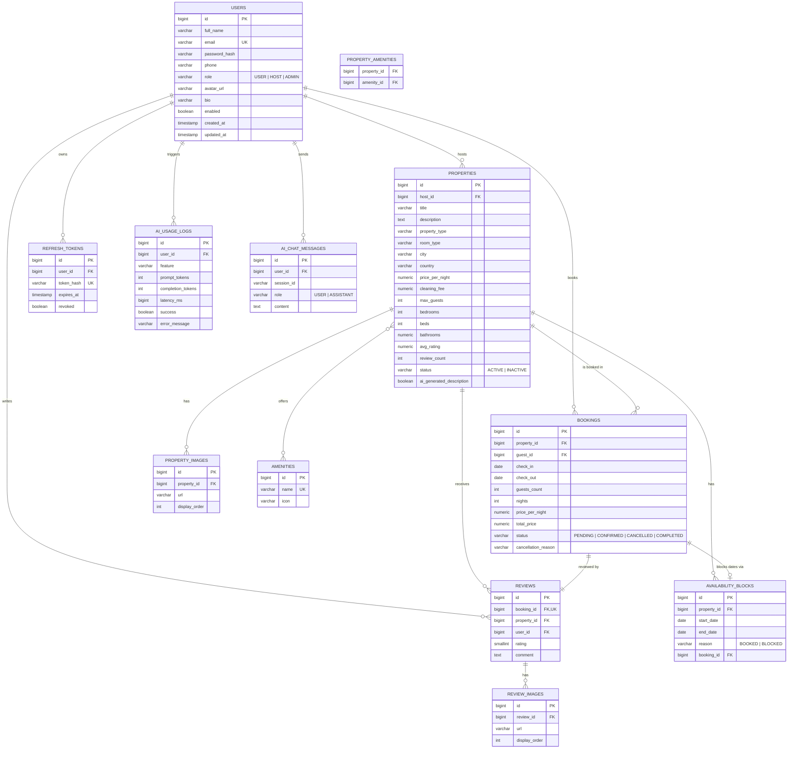

# Entity-Relationship Diagram

This matches the Flyway schema in [`backend/src/main/resources/db/migration/V1__init_schema.sql`](../backend/src/main/resources/db/migration/V1__init_schema.sql).
See [`DATABASE-SCHEMA.md`](DATABASE-SCHEMA.md) for column-level detail.

## Notes

- **`property_amenities`** is a pure join table (composite PK `property_id, amenity_id`) —
  no surrogate id, so it's shown here as a relationship rather than a boxed entity.
- **`availability_blocks.booking_id`** is a plain nullable FK: rows created from a
  confirmed booking carry `reason = 'BOOKED'` and reference it; rows a host creates
  manually (maintenance/personal use) carry `reason = 'BLOCKED'` and a null `booking_id`.
- **`reviews.booking_id`** is `UNIQUE` — enforcing "one review per completed stay" at
  the database level, not just in application code.
- **`properties.avg_rating` / `review_count`** are denormalized caches, recomputed by
  `ReviewService` on every create/update/delete so property listings can sort/filter by
  rating without aggregating `reviews` on every request.
