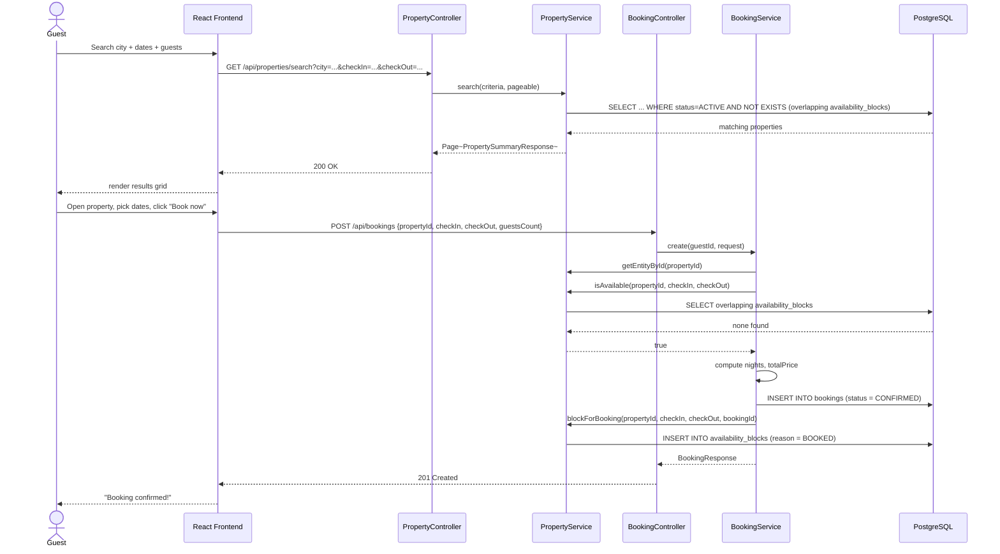
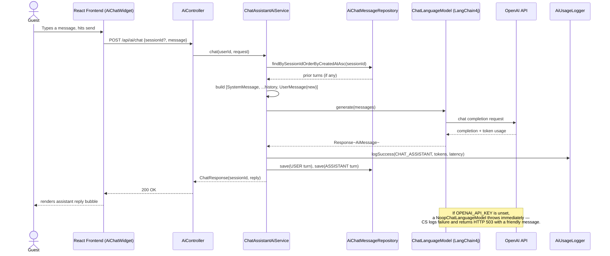
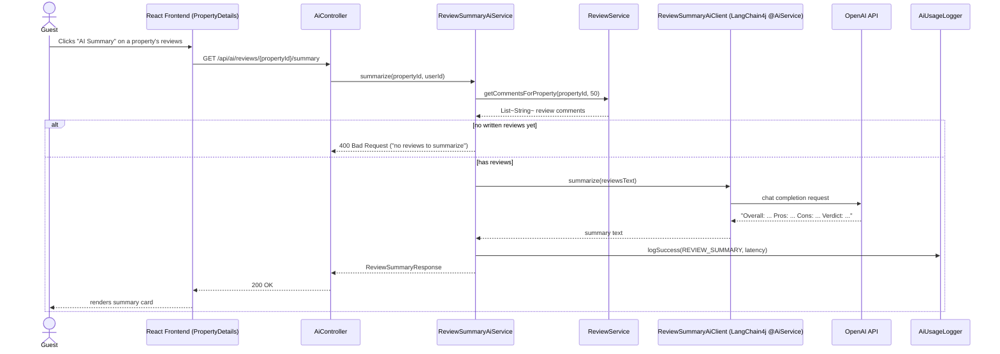

# Sequence Diagrams

## 1. Registration & JWT login

```mermaid
sequenceDiagram
    actor Guest
    participant FE as React Frontend
    participant Auth as AuthController
    participant Svc as AuthService
    participant Repo as UserRepository
    participant DB as PostgreSQL
    participant JWT as JwtService

    Guest->>FE: Fill registration form, submit
    FE->>Auth: POST /api/auth/register
    Auth->>Svc: register(RegisterRequest)
    Svc->>Repo: existsByEmail(email)
    Repo->>DB: SELECT
    DB-->>Repo: not found
    Svc->>Svc: BCrypt.encode(password)
    Svc->>Repo: save(User)
    Repo->>DB: INSERT
    Svc->>JWT: generateAccessToken(user)
    Svc->>JWT: generateRefreshToken(user)
    Svc->>Repo: save(RefreshToken hash)
    Svc-->>Auth: AuthResponse(accessToken, refreshToken, user)
    Auth-->>FE: 201 Created
    FE->>FE: store tokens (localStorage), set AuthContext.user
    FE-->>Guest: redirected to Home, logged in

    Note over FE,Auth: Later requests attach<br/>Authorization: Bearer &lt;accessToken&gt;
    FE->>Auth: (any protected request)
    Auth->>JWT: JwtAuthenticationFilter validates token
    JWT-->>Auth: principal = User, authorities = [ROLE_USER]
```

## 2. Search & book a property



## 3. AI Chat Assistant (multi-turn)



## 4. AI Review Summarization


