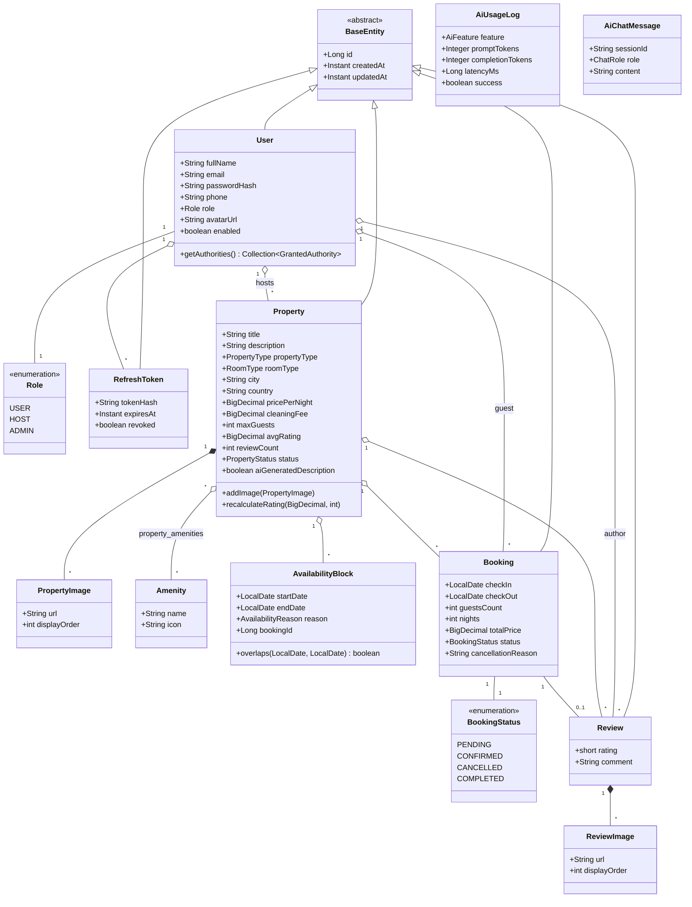
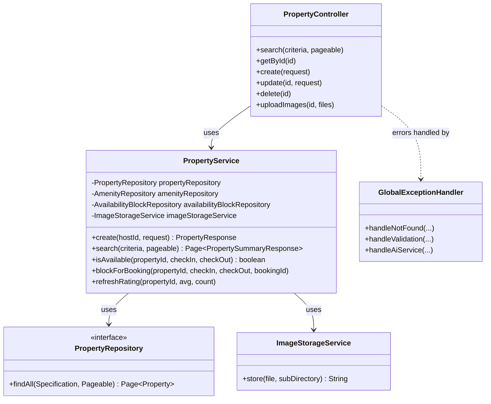

# UML Class Diagrams

## Domain model (entities)

## Backend layered architecture (per module)

Every module follows the same layering; `property` is shown as the representative example
— `user`, `booking`, `review`, `ai` and `admin` mirror this shape.

